# Architecture

This PoC has one FastAPI backend, one lightweight Streamlit operations app, and one n8n orchestration workflow. Batch intake extends the existing product pipeline rather than creating a second validation path.

```mermaid
flowchart LR
  S[Supplier CSV / XLSX] --> NWH[n8n multipart webhook]
  NWH -->|binary field: file| BA[FastAPI POST /batches/upload]
  BA --> BP[Batch parser<br/>all non-empty rows + row numbers]
  BP -->|each usable row| X[Existing ExtractionProvider]
  BP -->|structural failure| BE[(Batch row errors)]
  X -->|extraction failure| BE
  X --> V[Existing deterministic validation<br/>normalization + duplicate detection]
  V --> D{FastAPI initial decision}
  D -->|clean| AA[Straight-through approved]
  D -->|blocking issue / duplicate| R[Review required]
  AA --> DB[(SQLite<br/>batches + products + history)]
  R --> DB
  BE --> DB

  DB --> BR[FastAPI batch result + products]
  BR --> NS[n8n outcome summary]
  NS -->|no failures and never reviewed| OK[Automatic success placeholder]
  NS -->|backend review counts / statuses| RN[Review notification placeholder]
  NS -->|failed rows| EN[Ingestion alert placeholder]

  DB --> UI[Streamlit operations / review]
  RN --> UI
  UI -->|save correction| PA[FastAPI product endpoints]
  PA --> RV[Deterministic revalidation]
  RV -->|errors remain| R
  RV -->|valid reviewed product| RA[Ready for approval]
  RA -->|explicit reviewer approval| HA[Human-approved]
  R -->|explicit rejection| RJ[Rejected]
  HA --> DB
  RJ --> DB
```

The review and ingestion-error n8n routes are intentionally independent. A single batch can emit both placeholder notifications. n8n uses backend-returned counts and product statuses; it does not reproduce validation rules or independently approve products.

## Responsibility boundaries

### n8n: orchestration and integrations

The workflow receives one multipart CSV/XLSX file under the binary field `file`, forwards it to the Compose service URL `http://backend:8000/batches/upload`, retrieves `GET /batches/{id}/products`, and builds a concise outcome payload. Generic Edit Fields nodes show where a real notification, ticket, monitoring event, or approved downstream connector would attach.

The HTTP Request nodes retain n8n's default fail-fast behavior. A missing file, unsupported filename, non-2xx FastAPI response, unavailable backend, or malformed successful payload stops visibly instead of reaching a success placeholder.

### FastAPI: business logic and source of truth

FastAPI owns spreadsheet parsing, row provenance, extraction, normalization, deterministic validation, duplicate detection, persistence, decision history, approval state, and batch metrics. The n8n workflow only branches on those returned facts.

### Streamlit: human review

Streamlit shows batches and review queues. Reviewers correct product data, save it to rerun deterministic validation, and separately approve or reject. **Correction != approval.**

## Batch data flow

1. `POST /batches/upload` accepts CSV or XLSX and persists a processing batch.
2. The first non-empty spreadsheet row is the header. Every later non-empty row is converted to labelled text with its original row number. Missing cells are allowed; completely empty rows are ignored.
3. Structurally malformed rows become persisted `BatchRowError` entries. Each remaining row independently calls the existing `IntakeService`.
4. Extraction, normalization, deterministic validation, duplicate detection, and decision history therefore have one implementation.
5. Products store nullable `batch_id` and `source_row_number`; existing single-product intake remains compatible.
6. Batch counts are derived from current product state plus persisted historical attribution. `ready_for_approval` is not final approval.
7. n8n returns the batch ID/status plus independent clean, human-review, and partial-error flags.

## Duplicate handling

The product service checks the database before every insert. Earlier rows in a synchronous batch have already been committed, so a later matching EAN or product/supplier combination is detected exactly like a product from an older batch. The duplicate is persisted as a ProductRecord with a blocking issue and routed to human review.

## Row isolation and batch status

Parser failures and per-row extraction or intake failures are recorded with row number, code, and message. The service rolls back only the failed row and continues. Tests inject a provider failure between two successful rows to verify both earlier and later rows persist.

- `completed`: every non-empty data row produced a ProductRecord.
- `completed_with_errors`: at least one ProductRecord was created and at least one row failed ingestion.
- `failed`: no ProductRecord could be created.
- `processing`: transient synchronous processing state.

Product validation issues do not make the batch an ingestion failure; they create reviewable ProductRecords.

## Compose networking

Containers use Compose DNS names:

- n8n → `http://backend:8000`
- Streamlit → `http://backend:8000`

Browser-facing addresses remain `http://localhost:5678`, `http://localhost:8501`, and `http://localhost:8000`. The n8n service depends on backend startup, although production readiness checks and retry policies remain future work.

## Persistence and schema

SQLite stores a lightweight BatchRecord, JSON row errors, and product provenance. No relationship layer or full audit-event system is added. Task 1 approval history remains authoritative for straight-through versus human approval.

SQLAlchemy creates the schema directly. Existing pre-Task-2 PoC databases must be deleted and recreated; no Alembic migration is included. Task 3 changes orchestration and tests only, not the schema.

## Boundaries and limitations

The implementation is synchronous and intended for a PoC-sized catalogue. It reads one active XLSX worksheet and UTF-8 CSV. n8n notifications and downstream delivery are placeholders without credentials.

The Compose file keeps the existing `n8nio/n8n:latest` tag because Docker was unavailable while implementing this task; no unvalidated version was introduced. A production release must validate and pin an approved image or digest, then add readiness checks, bounded upload sizes, antivirus scanning, durable file storage, idempotency, asynchronous workers, credential management, retry/alert policies, audit events, and operational monitoring.
