# Architecture

This PoC has one deployable backend and one lightweight human-review app. Its boundaries are intentional: document parsing, extraction, validation, and persistence remain independently testable and replaceable.

```mermaid
flowchart LR
  S[Synthetic supplier TXT / CSV / XLSX / PDF] --> N[n8n webhook / trigger]
  N --> A[FastAPI intake API]
  A --> P[Deterministic parser]
  P --> X{ExtractionProvider}
  X --> M[Mock provider]
  X --> L[OpenAI-compatible LLM\nstructured JSON]
  M --> V[Deterministic validation\nnormalization + duplicate check]
  L --> V
  V --> D{Initial decision}
  D -->|clean| AA[Straight-through approved]
  D -->|blocking error| R[Review required]
  R --> U[Streamlit correction]
  U --> V2[Deterministic revalidation]
  V2 -->|errors remain| R
  V2 -->|no blocking errors| RA[Ready for approval]
  RA -->|explicit reviewer approval| HA[Human-approved]
  R -->|explicit rejection| RJ[Rejected]
  AA --> DB[(SQLite + decision history)]
  HA --> DB
  RJ --> DB
  DB --> O[JSON downstream boundary]
```

## Components and data flow

1. `POST /products` accepts labelled text; `POST /products/upload` accepts a CSV, XLSX, PDF, or TXT. Parsers produce plain, inspectable text and reject unsupported, empty, or malformed files.
2. An `ExtractionProvider` produces a Pydantic `Product` and optional evidence. `MockExtractionProvider` reads explicit field labels deterministically. `OpenAIExtractionProvider` requests JSON-schema structured output and validates it with Pydantic before it can enter the workflow.
3. Validation normalizes weight, country, and currency and independently applies required-field, checksum, price, food, conflict, and duplicate rules.
4. On initial intake, any error-level issue produces `review_required`; otherwise the record is straight-through `approved`.
5. A reviewer PATCH is a correction, not an approval. Validation reruns: error-level issues keep `review_required`, while a valid correction produces `ready_for_approval`. Only the explicit approve endpoint produces a human approval.

## State and historical metrics

SQLite persists the current and initial status, decision source, approval source, review/approval/rejection timestamps, and correction count. This is intentionally smaller than a full audit-event system. It is sufficient to keep the historical human-review rate stable after a record is approved and to distinguish straight-through automated approval from human-reviewed approval.

The schema is created directly by SQLAlchemy. Existing PoC databases must be deleted and recreated after this schema change; no Alembic migration is included.

## System boundaries and failure modes

Supplier text is untrusted. The parser has file and size boundaries; production would add antivirus scanning and object storage. The LLM is an optional external boundary: missing credentials, timeouts, non-JSON responses, and schema violations become explicit 422 failures rather than accepted records. Pydantic rejects unknown structured fields. SQLite errors are allowed to surface as server errors and must be captured by production monitoring/retry policy.

The review boundary is deliberate: **correction != approval**. Approval is blocked whenever error-level findings remain, and a corrected escalated record waits for an explicit human decision. This PoC does not treat probability as truth: mock `1.0` means only “a labelled source line was found”; the optional LLM provider emits no invented confidence. In production, confidence calibration would be measured from reviewed historical examples.

## Production hardening

Add authentication and role-based authorization, supplier-data retention controls, encrypted storage, audit events, a managed DB, queues/retries, rate limiting, observability, file scanning, integration credentials in a secret manager, and privacy-approved LLM controls. Treat prompt injection in document text as hostile input; isolate it from system instructions, minimize retrieved context, and retain reviewer oversight.
