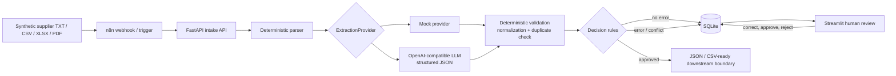

# Architecture

This PoC has one deployable backend and one lightweight human-review app. Its boundaries are intentional: document parsing, extraction, validation, and persistence remain independently testable and replaceable.

## Components and data flow

1. `POST /products` accepts labelled text; `POST /products/upload` accepts a CSV, XLSX, PDF, or TXT. Parsers produce plain, inspectable text and reject unsupported, empty, or malformed files.
2. An `ExtractionProvider` produces a Pydantic `Product` and optional evidence. `MockExtractionProvider` reads explicit field labels deterministically. `OpenAIExtractionProvider` requests JSON-schema structured output and validates it with Pydantic before it can enter the workflow.
3. Validation normalizes weight, country, and currency and independently applies required-field, checksum, price, food, conflict, and duplicate rules.
4. Any error-level issue makes the record `review_required`. Otherwise it is `approved`. The LLM cannot bypass that decision. A reviewer may save corrections; rules are re-run before approval is allowed.

## System boundaries and failure modes

Supplier text is untrusted. The parser has file and size boundaries; production would add antivirus scanning and object storage. The LLM is an optional external boundary: missing credentials, timeouts, non-JSON responses, and schema violations become explicit 422 failures rather than accepted records. Pydantic rejects unknown structured fields. SQLite errors are allowed to surface as server errors and must be captured by production monitoring/retry policy.

The review boundary is deliberate. Reviewer corrections and notes are persisted, while approval is blocked whenever error-level findings remain. This PoC does not treat probability as truth: mock `1.0` means only “a labelled source line was found”; the optional LLM provider emits no invented confidence. In production, confidence calibration would be measured from reviewed historical examples.

## Production hardening

Add authentication and role-based authorization, supplier-data retention controls, encrypted storage, audit events, a managed DB, queues/retries, rate limiting, observability, file scanning, integration credentials in a secret manager, and privacy-approved LLM controls. Treat prompt injection in document text as hostile input; isolate it from system instructions, minimize retrieved context, and retain reviewer oversight.
