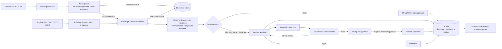

# Architecture

This PoC has one deployable backend and one lightweight Streamlit operations app. Batch intake extends the existing product pipeline rather than creating a second validation path.

## Components and data flow

1. `POST /batches/upload` accepts CSV or XLSX and persists a processing batch.
2. The first non-empty spreadsheet row is the header. Every later non-empty row is converted to labelled text with its original row number. Missing cells are allowed; completely empty rows are ignored.
3. Structurally malformed rows become persisted `BatchRowError` entries. Each remaining row independently calls the existing `IntakeService`.
4. Extraction, normalization, deterministic validation, duplicate detection, and Task 1 decision history therefore have one implementation.
5. Products store nullable `batch_id` and `source_row_number`; existing single-product intake remains compatible.
6. Batch counts are derived from current product state plus persisted historical attribution. `ready_for_approval` is not final approval.

## Duplicate handling

The product service checks the database before every insert. Earlier rows in a synchronous batch have already been committed, so a later matching EAN or product/supplier combination is detected exactly like a product from an older batch. The duplicate is persisted as a ProductRecord with a blocking issue and routed to human review.

## Row isolation and batch status

Parser failures and per-row extraction failures are recorded with row number, code, and message. The service rolls back only the failed row and continues.

- `completed`: every non-empty data row produced a ProductRecord.
- `completed_with_errors`: at least one ProductRecord was created and at least one row failed ingestion.
- `failed`: no ProductRecord could be created.
- `processing`: transient synchronous processing state.

Product validation issues do not make the batch an ingestion failure; they create reviewable ProductRecords.

## Persistence and schema

SQLite stores a lightweight BatchRecord, JSON row errors, and product provenance. No relationship layer or full audit-event system is added. Task 1 approval history remains authoritative for straight-through versus human approval.

SQLAlchemy creates the schema directly. Existing PoC databases must be deleted and recreated after this change; no Alembic migration is included.

## Boundaries and limitations

The implementation is synchronous and intended for a PoC-sized catalogue. It reads one active XLSX worksheet and UTF-8 CSV. Production would add file-size limits, antivirus scanning, durable file storage, asynchronous workers, idempotency, audit events, and operational monitoring.
